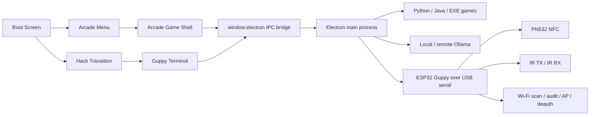

# The Lab Graduation - Arcade & Hacking Platform

<div align="center">

**A fullscreen Electron arcade launcher with retro UI, local games, a Guppy hacker terminal, ESP32 hardware integration, and optional Ollama AI hints.**

<br />


</div>

---

## What this project actually is

This project combines **two experiences in one desktop app**:

- **Arcade mode**: boot screen, retro game carousel, embedded game viewport, fullscreen launcher flow, and AI gameplay hints.
- **Guppy / hacker mode**: a terminal-like interface for NFC, IR, and Wi-Fi tooling through a DIY ESP32 hardware bridge.

The app runs on **Electron + React**, launches local **Python, Java, and EXE games**, communicates over **serial** with an **ESP32 Guppy board**, and can optionally talk to **Ollama** for short AI explanations while playing.

---

## What is currently included

- Fullscreen retro boot screen with CRT/glitch effects, gamepad support, and a hidden hack-to-terminal transition.
- Arcade menu with 11 built-in menu items and launch support for `.py`, `.jar`, and `.exe`.
- Embedded game launch mode with viewport data passed through environment variables.
- AI hint overlay per game via Ollama, with silent prefetch and fallback URL support.
- Auto-detect and auto-reconnect for a DIY Guppy device via `serialport`.
- Hacker terminal with tabs for `HOME`, `NFC`, `IR`, and `WIFI`.
- NFC UID capture + local JSON storage.
- IR database loader + IR send workflow through ESP32.
- Wi-Fi scan, audit, SoftAP profiles, and firmware-first deauth/jammer flow.
- Linux host fallback for the Wi-Fi jammer via `packetsender.py` + `scapy`.
- Cloud helper script to set up a GCP Ollama VM.
- ESP32 firmware, PN532 probe sketch, IR helper, and NFC helper in the same repo.

---

## Contents

- [High-level architecture](#high-level-architecture)
- [User flow](#user-flow)
- [Repository map](#repository-map)
- [Key source files](#key-source-files)
- [Game catalog](#game-catalog)
- [Guppy terminal and hardware features](#guppy-terminal-and-hardware-features)
- [AI and Ollama](#ai-and-ollama)
- [Requirements](#requirements)
- [Installation and quick start](#installation-and-quick-start)
- [Scripts and commands](#scripts-and-commands)
- [Environment variables](#environment-variables)
- [Persistent data and output](#persistent-data-and-output)
- [Adding new games](#adding-new-games)
- [Platform and runtime notes](#platform-and-runtime-notes)
- [Responsible use](#responsible-use)
- [Roadmap, docs, and team context](#roadmap-docs-and-team-context)

---

<a id="high-level-architecture"></a>

## High-level architecture



### Runtime layers

| Layer | Responsibility |
| --- | --- |
| `renderer` | Boot screen, arcade UI, Guppy terminal UI, input handling, AI overlay, Wi-Fi results modal |
| `preload` | Secure bridge between renderer and Electron main through `window.electron` |
| `main` | Window management, game launch/stop, serial auto-connect, Wi-Fi tooling, AI HTTP calls |
| `games` | Local Python, Java, and EXE games plus bundled assets |
| `firmware` | ESP32 bridge firmware, NFC/IR helpers, PN532 probe sketch |
| `docs` | Hardware quickstart, AI platform blueprint, IR mini database |
| `cloud_scripts` | Helper for setting up a GCP VM with Ollama |

---

<a id="user-flow"></a>

## User flow

### Arcade flow

1. The app opens fullscreen in the **boot screen**.
2. After the progress sequence, you can continue to the **arcade menu**.
3. A selected game starts through Electron IPC.
4. While a game is running, the app stays in an **arcade cabinet shell** with launch status, exit flow, and an optional AI hint overlay.
5. When the child process exits, the app automatically returns to the menu.

### Guppy / hacker flow

1. From the boot screen, click **HACK TERMINAL**.
2. A visual hack transition runs.
3. The app opens the **Guppy terminal**.
4. The main process automatically tries every few seconds to find a suitable serial device.
5. Once connected, NFC, IR, Wi-Fi, and raw serial commands become available.

---

<a id="repository-map"></a>

## Repository map

```text
.
├── README.md
├── package.json
├── package-lock.json
├── electron.vite.config.ts
├── tsconfig.json
├── cloud_scripts/
│   └── setup-gcp-ollama-vm.sh
├── docs/
│   ├── AI_ARCADE_PLATFORM_ARCHITECTURE.md
│   ├── DIYGUPPY_QUICKSTART.md
│   └── ir-mini-database.json
├── firmware/
│   └── esp32_guppy/
│       ├── esp32_guppy.ino
│       ├── diy_ir_mini.cpp / .h
│       ├── diy_nfca_reader.cpp / .h
│       ├── build_opt.h
│       └── pn532_hsu_probe/
├── scripts/
│   ├── run-electron-vite.js
│   └── setup-python-venv.js
├── out/
│   └── electron-vite build output
└── arcade-guppy/
    ├── tsconfig.json
    ├── src/
    │   ├── main.ts
    │   ├── preload.ts
    │   ├── renderer.tsx
    │   ├── electron.d.ts
    │   ├── shared/electron-types.ts
    │   ├── components/
    │   │   ├── arcade/
    │   │   └── guppy/
    │   ├── assets/
    │   └── games/
    └── wifijammer-2.0/
        ├── packetsender.py
        ├── pull.py
        ├── requirements.txt
        ├── README.md
        └── maclist/macs.txt
```

### Large bundled / vendored components

- `arcade-guppy/src/games/Mame_Emulator/` contains a full MAME bundle with upstream assets, docs, plugins, artwork, hashes, and samples.
- `arcade-guppy/src/games/RetroRaceGame/` contains both the buildable Java source code and the bundled `RetroRaceGame.jar`.
- `arcade-guppy/src/games/SuperMarioNES/` contains `Mario.jar`, native JInput libraries, and a settings file.
- `arcade-guppy/wifijammer-2.0/` contains the host fallback backend for Wi-Fi deauth/jammer workflows.

---

<a id="key-source-files"></a>

## Key source files

### Electron and renderer

| File | Role |
| --- | --- |
| `arcade-guppy/src/main.ts` | Core orchestrator: browser window, fullscreen, IPC, game launch/stop, serial auto-connect, Wi-Fi tooling, AI/Ollama calls |
| `arcade-guppy/src/preload.ts` | Exposes the `window.electron` API to the renderer |
| `arcade-guppy/src/renderer.tsx` | Root app state and routing between boot, arcade menu, game shell, and hacker menu |
| `arcade-guppy/src/shared/electron-types.ts` | Shared types for launch requests, Guppy status, Wi-Fi jammer payloads, and AI payloads |
| `arcade-guppy/src/electron.d.ts` | Type definitions for the global `window.electron` bridge |

### Arcade UI

| File | Role |
| --- | --- |
| `arcade-guppy/src/components/arcade/boot.tsx` | Retro boot screen, keyboard/gamepad start, top-right hack button |
| `arcade-guppy/src/components/arcade/GameMenu.tsx` | Game catalog, wheel/carousel, keyboard/gamepad/mousewheel navigation |
| `arcade-guppy/src/components/arcade/ArcadeGame.tsx` | Arcade cabinet shell around a launched game, progress overlay, exit flow, AI hints |

### Guppy UI

| File | Role |
| --- | --- |
| `arcade-guppy/src/components/guppy/HackTransition.tsx` | Visual CRT/matrix breach transition into hacker mode |
| `arcade-guppy/src/components/guppy/HackerMenu.tsx` | HOME/NFC/IR/WIFI terminal UI, raw serial console, Wi-Fi forms, and deauth controls |
| `arcade-guppy/src/components/guppy/WifiResultsModal.tsx` | Parses scan/audit output, deduplicates networks, and shows risk/vendor information |

### Config and build

| File | Role |
| --- | --- |
| `package.json` | npm scripts, runtime dependencies, Electron entrypoint |
| `electron.vite.config.ts` | Build config for main, preload, and renderer; `serialport` is externalized for the main build |
| `tsconfig.json` | Root TypeScript config for ambient Electron typing |
| `arcade-guppy/tsconfig.json` | TypeScript config for the app source code including JSX |
| `scripts/run-electron-vite.js` | Wrapper around `electron-vite` that resets `ELECTRON_RUN_AS_NODE` |
| `scripts/setup-python-venv.js` | Creates `arcade-guppy/.venv`, upgrades `pip`, installs `pygame`, and installs discovered `requirements*.txt` files under the games tree |

---

<a id="game-catalog"></a>

## Game catalog

The default catalog is hardcoded in `arcade-guppy/src/components/arcade/GameMenu.tsx`.

| Title | Runtime | Path | Note |
| --- | --- | --- | --- |
| `PONG` | Python | `games/pong.py` | 1P versus AI; starts gently and speeds up with each paddle hit |
| `PAC-MAN` | Python | `games/PacMan/pacman.py` | uses local assets/audio |
| `RETRO BIRD` | Python | `games/RetroBird/main.py` | Flappy Bird style |
| `Pixel Quest Adventure` | Java JAR | `games/SuperMarioNES/Mario.jar` | resolution is automatically updated in `Setting.txt` |
| `EXTREME RACING` | Python | `games/CarRacingUltraMaxExtremeLevel1000/main.py` | racing game with its own assets/audio |
| `BLOCK STORM` | Python | `games/BlockStorm/main.py` | falling-block gameplay |
| `RETRO RACE` | Java JAR | `games/RetroRaceGame/RetroRaceGame.jar` | source code included in the repo |
| `ANGRY WALLS` | Python | `games/AngryWalls/main.py` | dungeon/loot style |
| `ELEMENTAL CLASH` | Python | `games/ElementalClash/src/main.py` | 2P duel |
| `SPACE INVADER` | Python | `games/spaceinvaders.py` | space shooter |
| `EMULATOR` | EXE | `games/Mame_Emulator/mame.exe` | Windows-native MAME executable |

### Launch behavior per extension

| Type | How it is launched |
| --- | --- |
| `.py` | through `python3` or `python`, or through `ARCADE_PYTHON`, or through `arcade-guppy/.venv` if `pygame` is available there |
| `.jar` | through `java -jar`, or through `ARCADE_JAVA` / `JAVA_HOME` |
| `.exe` | directly as a child process |

### Launch metadata passed by the app

For embedded-mode launches, the main process sets these env vars:

- `ARCADE_EMBEDDED=1` or `0`
- `ARCADE_WINDOW_POS=x,y`
- `ARCADE_WINDOW_SIZE=widthxheight`

### In-game AI hints

- A gameplay hint is prefetched in the background as soon as a game is running.
- The hint overlay unlocks after about **20 seconds**.
- If a hint is already cached, it appears almost immediately.

### Pong versus AI

- `PONG` plays **against an AI paddle** by default instead of pure 2P local play.
- Without a remote endpoint, the game uses a local fallback AI so the match remains realtime.
- With an Ollama-compatible Gemma endpoint on GCP, the right paddle can be controlled by remote decisions plus local smoothing.
- The ball intentionally starts slower than before and now accelerates gradually with each paddle hit, with a light extra acceleration over time.

---

<a id="guppy-terminal-and-hardware-features"></a>

## Guppy terminal and hardware features

### UI views

| View | Function |
| --- | --- |
| `HOME` | hardware status, latest serial line, shortcuts to NFC/IR/WIFI |
| `NFC` | `RUN NFC_CLONE`, `NFC_READ`, show UID, save capture as JSON |
| `IR` | IR DB reload, select entry, send `IR_SEND` |
| `WIFI` | scan, audit, AP profile management, AP start/stop, deauth/jammer controls |

### What the renderer actually does

- Listens to realtime status events: `guppy-status`, `guppy-line`, `wifi-jammer-state`, `wifi-jammer-log`, `game-exited`.
- Supports keyboard and gamepad navigation in both arcade and hacker mode.
- Keeps a local serial log in the UI with rolling history.
- Parses NFC, IR, and Wi-Fi status from raw serial output.

### What the main process actually does

- Scans for serial ports every **3 seconds** while auto-connect is enabled.
- Attempts handshakes with `HELLO` and `PING`.
- Recognizes Guppy hardware based on serial metadata and handshake markers such as:
  - `GUPPY_READY`
  - `PONG`
  - `FW:esp32-bridge`
  - `CAPS:...`
- Tracks capability flags from the firmware `CAPS:` line.

### Known Guppy module commands

At the protocol level, the app knows these module keys:

| Module key | Sent command |
| --- | --- |
| `nfc` | `RUN NFC_CLONE` |
| `badusb` | `RUN BADUSB_INJECT` |
| `ir` | `RUN IR_BLAST` |
| `gpio` | `RUN GPIO_CTRL` |
| `wifi` | `RUN WIFI_AUDIT` |
| `wifiap` | `RUN WIFI_AP_START` |
| `terminal` | `RUN SHELL` |

The current UI mainly focuses on **NFC**, **IR**, and **Wi-Fi**. `BADUSB`, `GPIO`, and `SHELL` are already present as protocol/extension support.

### NFC

- ESP32 firmware supports `NFC_READ` and `RUN NFC_CLONE`.
- Captures are stored as JSON with `uid`, `label`, `capturedAt`, `source`, and `rawLine`.
- The UI marks NFC health based on incoming serial output such as `NFC_UID`, `PN532 not detected`, or `NFC=...`.

### IR

- The app loads `docs/ir-mini-database.json` by default.
- That database currently contains **24 sample entries** for TV, soundbar, projector, LED strip, fan, and camera remotes, among others.
- If that JSON is missing or broken, the app falls back to a **built-in fallback** with 4 NEC samples.
- Sending happens via `IR_SEND <protocol> <address> <command> <carrierKhz>`.

### Wi-Fi

- Scan results are parsed from serial output and turned into a network model with:
  - SSID
  - RSSI
  - security
  - channel
  - BSSID
  - risk score
- The results modal enriches BSSIDs with vendor info from `arcade-guppy/wifijammer-2.0/maclist/macs.txt`.
- The vendor list currently contains **24,609** prefix lines.

### Wi-Fi AP profile

- Stored locally and reloaded on reconnect.
- Requirements from the code:
  - SSID required
  - SSID max 32 chars
  - no spaces in SSID
  - password empty or 8-63 chars
  - no spaces in password
  - channel is clamped between 1 and 13

### Wi-Fi deauth / jammer modes

The app supports two backends:

| Mode | Description |
| --- | --- |
| `firmware` | recommended; sends a start/stop command to the ESP32 if the firmware advertises matching `CAPS` |
| `host` | fallback; starts `arcade-guppy/wifijammer-2.0/packetsender.py` on the host |

#### Firmware-first behavior

The UI automatically tries to use a firmware backend when the device contains `CAPS:` entries such as:

- `WIFI_DEAUTH_START` + `WIFI_DEAUTH_STOP`
- `WIFI_JAMMER_START` + `WIFI_JAMMER_STOP`
- `WIFI_JAM_START` + `WIFI_JAM_STOP`

#### Host fallback behavior

- Only supported on **Linux**.
- Requires at least one interface already in **monitor mode**.
- Uses `iwconfig` to auto-detect that interface.
- Then starts `packetsender.py` through Python.

---

<a id="ai-and-ollama"></a>

## AI and Ollama

### What the AI feature does

- Provides a short explanation of how to play a selected game.
- Keeps the text compact.
- Uses `title`, `genre`, `difficulty`, and optionally `lastEvent`.

### How the call works

1. The renderer calls `window.electron.aiExplain(...)`.
2. The main process first checks whether Ollama is reachable via `/api/tags`.
3. It then calls `/api/chat` with the selected model.
4. If the primary URL fails, an optional fallback URL can be used.

### Default runtime defaults

| Variable | Default | Meaning |
| --- | --- | --- |
| `OLLAMA_URL` | `http://localhost:11434` | primary Ollama endpoint |
| `OLLAMA_FALLBACK_URL` | empty | optional fallback endpoint |
| `OLLAMA_MODEL` | `gemma2:27b` | model name |
| `OLLAMA_TIMEOUT_MS` | `45000` | timeout for AI requests |
| `OLLAMA_KEEP_ALIVE_SEC` | `1800` | keeps the model loaded |

### Pong AI runtime

`arcade-guppy/src/games/pong.py` can use the same remote Ollama/GCP stack as the hint feature.

Main variables:

| Variable | Default | Meaning |
| --- | --- | --- |
| `PONG_AI_MODE` | `hybrid` | `local`, `hybrid`, or `remote` |
| `PONG_AI_URL` | `OLLAMA_FALLBACK_URL` or `OLLAMA_URL` | base URL for the remote AI |
| `PONG_AI_ENDPOINT` | empty | optional exact endpoint; overrides `PONG_AI_URL` |
| `PONG_AI_MODEL` | `OLLAMA_MODEL` or `gemma3:4b` | model name for the paddle AI |
| `PONG_AI_TIMEOUT_MS` | `900` | timeout per paddle decision |
| `PONG_AI_INTERVAL_MS` | `280` | poll interval for remote decisions |
| `PONG_AI_SEAMLESS_FALLBACK` | `0` | keeps the remote AI path visually active if the endpoint is unavailable |
| `PONG_AI_LOG` | `0` | when `1`, writes a JSONL decision trace for the Pong AI |
| `PONG_AI_LOG_WINDOW` | `0` | when `1`, opens a live Pong console window in Terminal on macOS or `cmd.exe` on Windows |
| `PONG_CONSOLE_LOG_PATH` | `arcade-guppy/logs/pong-console.log` | optional path override for the live Pong stdout/stderr log |
| `PONG_AI_LOG_PATH` | `arcade-guppy/logs/pong-ai.jsonl` | optional path override for the AI trace file |
| `PONG_AI_LOG_RAW` | `1` | include the raw model response text in the trace |
| `PONG_AI_LOG_SNAPSHOT` | `1` | include the game snapshot sent to the model |
| `PONG_BALL_START_SPEED` | `6.0` | initial ball speed |
| `PONG_BALL_HIT_ACCEL` | `1.08` | multiplicative boost per paddle hit |
| `PONG_BALL_MAX_SPEED` | `20.0` | hard cap on ball speed |

When logging is enabled, the file contains JSONL entries for request scheduling, remote responses, parsed decisions, source switches (`remote`, `hybrid`, `local_fallback`), errors, and session start/end. This traces the AI decision flow, not hidden model chain-of-thought. If `PONG_AI_LOG_WINDOW=1`, the desktop launcher also opens a separate live console window that tails the raw Pong stdout/stderr output on macOS and Windows.

Example with a GCP Ollama VM:

```bash
OLLAMA_FALLBACK_URL=http://<gcp-ip>:11434 OLLAMA_MODEL=gemma3:4b npm run dev
```

### GCP helper script

`cloud_scripts/setup-gcp-ollama-vm.sh` automates a simple remote Ollama VM.

What the script does:

- sets up an Ubuntu 22.04 VM on GCP;
- installs Ollama;
- opens port `11434`;
- restricts firewall access to your public IP by default;
- automatically pulls the selected model;
- supports spot instances.

Main script variables:

| Variable | Default |
| --- | --- |
| `PROJECT_ID` | `inbound-decker-475607-d6` |
| `INSTANCE_NAME` | `ollama-vm` |
| `ZONE` | `europe-west1-b` |
| `MACHINE_TYPE` | `n2-highmem-8` |
| `MODEL_NAME` | `gemma2:27b` |
| `ALLOWED_CIDR` | `auto` |
| `SPOT` | `true` |

### Roadmap document

The longer AI/multiplayer/cyber vision is described in:

- [docs/AI_ARCADE_PLATFORM_ARCHITECTURE.md](docs/AI_ARCADE_PLATFORM_ARCHITECTURE.md)

That document describes the **future architecture**, not just the current implementation.

---

<a id="requirements"></a>

## Requirements

### Core

- Node.js 18+
- npm 9+
- Python 3.10+ or compatible

### For all Python games

- `pygame`

### For Java games

- a working Java runtime on `PATH`
- or `JAVA_HOME`
- or `ARCADE_JAVA`

### For AI hints

- an Ollama instance, local or remote

### For hardware mode

- ESP32 dev board
- PN532 NFC module
- IR TX module
- IR RX module
- USB serial connection

### For the Linux host fallback Wi-Fi backend

- Linux
- `iwconfig`
- monitor-mode interface
- `scapy==2.4.3`

---

<a id="installation-and-quick-start"></a>

## Installation and quick start

### 1. Node dependencies

```bash
npm install
```

### 2. Python environment for games

Recommended:

```bash
npm run setup:python
```

What this does:

- creates `arcade-guppy/.venv`;
- upgrades `pip`;
- installs `pygame`;
- installs discovered `requirements*.txt` files under the game source tree.

Manual setup is also possible:

```bash
python3 -m venv arcade-guppy/.venv
source arcade-guppy/.venv/bin/activate
pip install pygame
```

### 3. Extra dependency for the Linux host fallback jammer

`npm run setup:python` does **not** automatically install `scapy` from `arcade-guppy/wifijammer-2.0/requirements.txt`, because that directory sits outside the scanned game tree.

So install it separately when you need the host fallback:

```bash
source arcade-guppy/.venv/bin/activate
pip install -r arcade-guppy/wifijammer-2.0/requirements.txt
```

### 4. Start the app

```bash
npm run dev
```

### 5. Optional: run Ollama locally

Example:

```bash
OLLAMA_URL=http://localhost:11434 npm run dev
```

For Pong against a remote Gemma model on GCP, you can also use:

```bash
OLLAMA_FALLBACK_URL=http://<gcp-ip>:11434 OLLAMA_MODEL=gemma3:4b npm run dev
```

### 6. Optional: connect hardware

With correct ESP32 firmware, the app will try to connect automatically. In normal cases, you do not need to select a port manually.

For the hardware quickstart, see:

- [docs/DIYGUPPY_QUICKSTART.md](docs/DIYGUPPY_QUICKSTART.md)

---

<a id="scripts-and-commands"></a>

## Scripts and commands

| Command | What it does |
| --- | --- |
| `npm run dev` | starts Electron + Vite in development mode |
| `npm run build` | builds main, preload, and renderer into `out/` |
| `npm run preview` | previews the built Electron app |
| `npm run typecheck` | `tsc --noEmit -p arcade-guppy/tsconfig.json` |
| `npm run check` | typecheck + build |
| `npm run test` | alias of `npm run check` |
| `npm run setup:python` | creates/updates `arcade-guppy/.venv` and installs Python dependencies |

---

<a id="environment-variables"></a>

## Environment variables

| Variable | Usage |
| --- | --- |
| `ARCADE_PYTHON` | forces the Python interpreter for `.py` launches |
| `ARCADE_JAVA` | forces the Java binary for `.jar` launches |
| `JAVA_HOME` | fallback for Java detection |
| `OLLAMA_URL` | primary Ollama endpoint |
| `OLLAMA_FALLBACK_URL` | optional fallback endpoint |
| `OLLAMA_MODEL` | model for AI hints |
| `OLLAMA_TIMEOUT_MS` | request timeout |
| `OLLAMA_KEEP_ALIVE_SEC` | model keep-alive |
| `PONG_AI_MODE` | AI mode for Pong: `local`, `hybrid`, or `remote` |
| `PONG_AI_URL` | base URL for remote Pong AI |
| `PONG_AI_ENDPOINT` | exact endpoint for remote Pong AI |
| `PONG_AI_MODEL` | model name for the Pong opponent |
| `PONG_AI_TIMEOUT_MS` | timeout per Pong AI call |
| `PONG_AI_INTERVAL_MS` | Pong AI poll interval |
| `PONG_BALL_START_SPEED` | starting speed of the Pong ball |
| `PONG_BALL_HIT_ACCEL` | acceleration per paddle hit |
| `PONG_BALL_MAX_SPEED` | max speed of the Pong ball |

---

<a id="persistent-data-and-output"></a>

## Persistent data and output

### Runtime data in Electron `userData`

| File / folder | Contents |
| --- | --- |
| `userData/guppy/nfc-captures/` | stored NFC captures as JSON |
| `userData/guppy/wifi-ap-profile.json` | most recently saved Wi-Fi AP profile |

### Repository output / mutations

| Path | Contents |
| --- | --- |
| `out/` | electron-vite build output |
| `arcade-guppy/.venv/` | local Python virtual environment |
| `arcade-guppy/src/games/SuperMarioNES/Setting.txt` | modified to match the target resolution |

---

<a id="adding-new-games"></a>

## Adding new games

Adding new launchable games happens in `arcade-guppy/src/components/arcade/GameMenu.tsx`.

### Steps

1. Put the game files under `arcade-guppy/src/games/...`.
2. Add a thumbnail under `arcade-guppy/src/assets/...`.
3. Add a new object to the `games` array in `GameMenu.tsx`.
4. Use an executable path relative to `arcade-guppy/src`.

Examples:

```ts
executable: 'games/MyPythonGame/main.py'
executable: 'games/MyJavaGame/game.jar'
executable: 'games/MyNativeGame/game.exe'
```

### What the launcher enforces

- Path traversal is blocked in `main.ts`.
- Only paths inside the app base path may be launched.
- Supported extensions are currently only `.py`, `.jar`, and `.exe`.

---

## Firmware, docs, and support files

### ESP32 firmware

Main firmware files:

| File | Role |
| --- | --- |
| `firmware/esp32_guppy/esp32_guppy.ino` | main firmware for the USB serial bridge |
| `firmware/esp32_guppy/diy_ir_mini.cpp/.h` | IR sender helper |
| `firmware/esp32_guppy/diy_nfca_reader.cpp/.h` | PN532 NFC-A reader helper |
| `firmware/esp32_guppy/build_opt.h` | compile flag for NFC I2C mode |
| `firmware/esp32_guppy/pn532_hsu_probe/` | separate probe sketch for PN532 HSU diagnostics |

### Default wiring from the current firmware

| ESP32 pin | Function |
| --- | --- |
| `GPIO21` | PN532 `SDA` |
| `GPIO22` | PN532 `SCL` |
| `GPIO27` | PN532 `IRQ` |
| `GPIO26` | PN532 `RST` |
| `GPIO4` | IR TX |
| `GPIO34` | IR RX |
| `GPIO16` | Pico `TX` to ESP32 `RX2` |
| `GPIO17` | Pico `RX` to ESP32 `TX2` |

### Firmware defaults

- Serial baud rate: `115200`
- Default SoftAP SSID: `GUPPY_LAB`
- Default SoftAP channel: `6`
- Default IR blast payload: `NEC 0x20DF 0x10EF 38`

### Firmware capabilities currently present in code

The ESP32 bridge prints, among other things, on boot:

- `GUPPY_READY`
- `FW:esp32-bridge-v2`
- `CAPS:NFC_CLONE,NFC_READ,IR_BLAST,IR_SEND,GPIO_CTRL,WIFI_SCAN,WIFI_AUDIT,WIFI_AP_START,WIFI_AP_STOP,WIFI_AP_STATUS,BADUSB_INJECT,SHELL`

### Useful companion docs

- [docs/DIYGUPPY_QUICKSTART.md](docs/DIYGUPPY_QUICKSTART.md)
- [docs/AI_ARCADE_PLATFORM_ARCHITECTURE.md](docs/AI_ARCADE_PLATFORM_ARCHITECTURE.md)
- [docs/ir-mini-database.json](docs/ir-mini-database.json)
- [arcade-guppy/wifijammer-2.0/README.md](arcade-guppy/wifijammer-2.0/README.md)

---

<a id="platform-and-runtime-notes"></a>

## Platform and runtime notes

### OS support in practice

| Component | Note |
| --- | --- |
| Electron app shell | basically works cross-platform |
| Python games | work wherever Python + `pygame` are available |
| Java games | require a Java runtime |
| `mame.exe` | is a Windows-native executable |
| host Wi-Fi fallback | Linux only |
| macOS window placement | uses `osascript` / Accessibility |

### Important runtime details

- On **Windows**, the renderer `webContents` automatically sets a zoom factor of `0.85`.
- On **macOS**, the app tries to position/fullscreen child windows through `osascript`.
- When a game crashes or exits, the arcade window is restored and `game-exited` is sent to the renderer.
- `npm run build` produces build output, but **does not create an installer or distribution package**.

### Troubleshooting

| Problem | Likely cause |
| --- | --- |
| Python game does not start | missing `pygame` or wrong interpreter |
| Java game does not start | missing Java runtime or incorrect `ARCADE_JAVA`/`JAVA_HOME` |
| Guppy stays offline | no serial device, no handshake, missing firmware, or insufficient port permissions |
| Wi-Fi host fallback does not start | no Linux monitor interface or missing `packetsender.py` dependencies |
| macOS embedded windowing does not work | missing Accessibility permissions for Terminal/Electron |

---

<a id="responsible-use"></a>

## Responsible use

This project contains tooling for:

- hardware prototyping,
- NFC/IR experiments,
- Wi-Fi scanning,
- and lab-oriented security features.

Use these parts **only in a controlled environment and with explicit permission**. The Wi-Fi deauth/jammer functionality belongs in a test lab, classroom environment, or authorized demo setup, not on networks or devices for which you do not have permission.

---

<a id="roadmap-docs-and-team-context"></a>

## Roadmap, docs, and team context

### Current focus

The current repo is already a working combination of:

- retro arcade launcher;
- local game library;
- hardware bridge;
- terminal-style tooling;
- AI assistance through Ollama.

### Future vision

The architecture roadmap targets:

- multiplayer sessions;
- realtime score sync;
- AI orchestration via local + GCP;
- sandboxed cyber challenges;
- observability and backend services.

See:

- [docs/AI_ARCADE_PLATFORM_ARCHITECTURE.md](docs/AI_ARCADE_PLATFORM_ARCHITECTURE.md)

### Team context

The Lab Graduation Project:

- Younes: arcade platform, launcher, and interface
- Rayan: hardware, arcade cabinet, buttons, and computer setup
- Matthias: Raspberry Pi Pico hacking tool

---

## Summary in one sentence

**This project is a local arcade and hardware-hacking desktop environment where Electron handles the UI and orchestration, launches local games, controls ESP32 hardware over serial, exposes Wi-Fi/NFC/IR workflows, and optionally uses Ollama for AI gameplay hints.**
