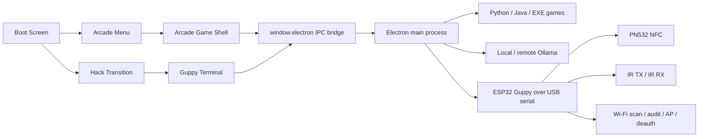

# The Lab Graduation - Arcade & Hacking Platform

<div align="center">

**Een fullscreen Electron arcade launcher met retro UI, lokale games, een Guppy hacker terminal, ESP32-hardware-integratie en optionele Ollama AI-hints.**

<br />


</div>

---

## Wat dit project precies is

Dit project combineert **twee experiences in één desktop-app**:

- **Arcade mode**: boot screen, retro game carousel, embedded game viewport, fullscreen launcher-flow en AI speelhints.
- **Guppy / hacker mode**: een terminal-achtige interface voor NFC, IR en Wi-Fi tooling via een DIY ESP32-hardware bridge.

De app draait op **Electron + React**, lanceert lokale **Python-, Java- en EXE-games**, praat via **serial** met een **ESP32 Guppy board**, en kan optioneel **Ollama** aanspreken voor korte AI-uitleg tijdens het spelen.

---

## Wat er vandaag allemaal in zit

- Fullscreen retro boot screen met CRT/glitch-effecten, gamepad support en hidden hack-to-terminal overgang.
- Arcade menu met 11 ingebouwde menu-items en launch support voor `.py`, `.jar` en `.exe`.
- Embedded game launch mode met viewport-data via environment variables.
- AI hint overlay per game via Ollama, met silent prefetch en fallback-URL support.
- Auto-detect en auto-reconnect van een DIY Guppy device via `serialport`.
- Hacker terminal met tabs voor `HOME`, `NFC`, `IR` en `WIFI`.
- NFC UID capture + lokale JSON-opslag.
- IR database loader + IR send workflow via ESP32.
- Wi-Fi scan, audit, SoftAP-profielen en firmware-first deauth/jammer flow.
- Linux host fallback voor de Wi-Fi jammer via `packetsender.py` + `scapy`.
- Cloud helper script om een GCP Ollama VM op te zetten.
- ESP32 firmware, PN532 probe sketch, IR helper en NFC helper in dezelfde repo.

---

## Inhoud

- [Architectuur op hoog niveau](#architectuur-op-hoog-niveau)
- [Gebruikersflow](#gebruikersflow)
- [Repository map](#repository-map)
- [Belangrijkste bronbestanden](#belangrijkste-bronbestanden)
- [Gamecatalogus](#gamecatalogus)
- [Guppy terminal en hardwarefeatures](#guppy-terminal-en-hardwarefeatures)
- [AI en Ollama](#ai-en-ollama)
- [Vereisten](#vereisten)
- [Installatie en quick start](#installatie-en-quick-start)
- [Scripts en commands](#scripts-en-commands)
- [Environment variables](#environment-variables)
- [Persistente data en output](#persistente-data-en-output)
- [Nieuwe games toevoegen](#nieuwe-games-toevoegen)
- [Platform- en runtime-notes](#platform--en-runtime-notes)
- [Responsible use](#responsible-use)
- [Roadmap, docs en teamcontext](#roadmap-docs-en-teamcontext)

---

<a id="architectuur-op-hoog-niveau"></a>

## Architectuur op hoog niveau



### Runtime lagen

| Laag | Verantwoordelijkheid |
| --- | --- |
| `renderer` | Boot screen, arcade UI, Guppy terminal UI, input handling, AI overlay, Wi-Fi results modal |
| `preload` | Veilige bridge tussen renderer en Electron main via `window.electron` |
| `main` | Window management, game launch/stop, serial auto-connect, Wi-Fi tooling, AI HTTP-calls |
| `games` | Lokale Python-, Java- en EXE-games plus gebundelde assets |
| `firmware` | ESP32 bridge firmware, NFC/IR helpers, PN532 probe sketch |
| `docs` | Hardware quickstart, AI platform blueprint, IR mini database |
| `cloud_scripts` | Helper voor het opzetten van een GCP VM met Ollama |

---

<a id="gebruikersflow"></a>

## Gebruikersflow

### Arcade flow

1. De app opent fullscreen in het **boot screen**.
2. Na de progressie kun je naar het **arcade menu**.
3. Een geselecteerde game start via Electron IPC.
4. Tijdens een game draait de app in een **arcade cabinet shell** met launch status, exit flow en optionele AI-hint overlay.
5. Bij afsluiten van de child process keert de app automatisch terug naar het menu.

### Guppy / hacker flow

1. Vanuit het boot screen klik je op **HACK TERMINAL**.
2. Er draait een visuele hack-transition.
3. De app opent de **Guppy terminal**.
4. De main process probeert automatisch elke paar seconden een geschikte serial device te vinden.
5. Bij connectie worden NFC, IR, Wi-Fi en raw serial commands beschikbaar.

---

<a id="repository-map"></a>

## Repository map

```text
.
├── README.md
├── package.json
├── package-lock.json
├── electron.vite.config.ts
├── tsconfig.json
├── cloud_scripts/
│   └── setup-gcp-ollama-vm.sh
├── docs/
│   ├── AI_ARCADE_PLATFORM_ARCHITECTURE.md
│   ├── DIYGUPPY_QUICKSTART.md
│   └── ir-mini-database.json
├── firmware/
│   └── esp32_guppy/
│       ├── esp32_guppy.ino
│       ├── diy_ir_mini.cpp / .h
│       ├── diy_nfca_reader.cpp / .h
│       ├── build_opt.h
│       └── pn532_hsu_probe/
├── scripts/
│   ├── run-electron-vite.js
│   └── setup-python-venv.js
├── out/
│   └── electron-vite build output
└── arcade-guppy/
    ├── tsconfig.json
    ├── src/
    │   ├── main.ts
    │   ├── preload.ts
    │   ├── renderer.tsx
    │   ├── electron.d.ts
    │   ├── shared/electron-types.ts
    │   ├── components/
    │   │   ├── arcade/
    │   │   └── guppy/
    │   ├── assets/
    │   └── games/
    └── wifijammer-2.0/
        ├── packetsender.py
        ├── pull.py
        ├── requirements.txt
        ├── README.md
        └── maclist/macs.txt
```

### Grote gebundelde / vendored onderdelen

- `arcade-guppy/src/games/Mame_Emulator/` bevat een volledige MAME-bundle met upstream assets, docs, plugins, artwork, hashes en samples.
- `arcade-guppy/src/games/RetroRaceGame/` bevat zowel de buildbare Java-broncode als de gebundelde `RetroRaceGame.jar`.
- `arcade-guppy/src/games/SuperMarioNES/` bevat `Mario.jar`, native JInput libraries en settingsbestand.
- `arcade-guppy/wifijammer-2.0/` bevat de host fallback backend voor Wi-Fi deauth/jammer workflows.

---

<a id="belangrijkste-bronbestanden"></a>

## Belangrijkste bronbestanden

### Electron en renderer

| Bestand | Rol |
| --- | --- |
| `arcade-guppy/src/main.ts` | Core orchestrator: browser window, fullscreen, IPC, game launch/stop, serial auto-connect, Wi-Fi tooling, AI/Ollama calls |
| `arcade-guppy/src/preload.ts` | Exposeert `window.electron` API naar de renderer |
| `arcade-guppy/src/renderer.tsx` | Root app-state en routing tussen boot, arcade menu, game shell en hacker menu |
| `arcade-guppy/src/shared/electron-types.ts` | Shared types voor launch requests, Guppy status, Wi-Fi jammer payloads, AI payloads |
| `arcade-guppy/src/electron.d.ts` | Type-definities voor de globale `window.electron` bridge |

### Arcade UI

| Bestand | Rol |
| --- | --- |
| `arcade-guppy/src/components/arcade/boot.tsx` | Retro boot screen, keyboard/gamepad start, top-right hack button |
| `arcade-guppy/src/components/arcade/GameMenu.tsx` | Gamecatalogus, wheel/carousel, keyboard/gamepad/mousewheel navigatie |
| `arcade-guppy/src/components/arcade/ArcadeGame.tsx` | Arcade cabinet shell rond een gelanceerde game, progress overlay, exit flow, AI hints |

### Guppy UI

| Bestand | Rol |
| --- | --- |
| `arcade-guppy/src/components/guppy/HackTransition.tsx` | Visuele CRT/matrix breach transition naar hacker mode |
| `arcade-guppy/src/components/guppy/HackerMenu.tsx` | HOME/NFC/IR/WIFI terminal-UI, raw serial console, Wi-Fi forms en deauth controls |
| `arcade-guppy/src/components/guppy/WifiResultsModal.tsx` | Parseert scan/audit output, dedupliceert netwerken en toont risico-/vendorinformatie |

### Config en build

| Bestand | Rol |
| --- | --- |
| `package.json` | npm scripts, runtime dependencies, Electron entrypoint |
| `electron.vite.config.ts` | buildconfig voor main, preload en renderer; `serialport` is extern voor de main build |
| `tsconfig.json` | root TypeScript config voor ambient Electron typing |
| `arcade-guppy/tsconfig.json` | TypeScript config voor de app-broncode inclusief JSX |
| `scripts/run-electron-vite.js` | wrapper rond `electron-vite` die `ELECTRON_RUN_AS_NODE` reset |
| `scripts/setup-python-venv.js` | maakt `arcade-guppy/.venv`, upgrade `pip`, installeert `pygame` en gevonden `requirements*.txt` onder de games-tree |

---

<a id="gamecatalogus"></a>

## Gamecatalogus

De standaardcatalogus staat hardcoded in `arcade-guppy/src/components/arcade/GameMenu.tsx`.

| Titel | Runtime | Pad | Opmerking |
| --- | --- | --- | --- |
| `PONG` | Python | `games/pong.py` | 1P versus AI; start zacht en versnelt per paddle-hit |
| `PAC-MAN` | Python | `games/PacMan/pacman.py` | gebruikt lokale assets/audio |
| `RETRO BIRD` | Python | `games/RetroBird/main.py` | Flappy Bird-stijl |
| `Pixel Quest Adventure` | Java JAR | `games/SuperMarioNES/Mario.jar` | resolutie wordt automatisch in `Setting.txt` geüpdatet |
| `EXTREME RACING` | Python | `games/CarRacingUltraMaxExtremeLevel1000/main.py` | racegame met eigen assets/audio |
| `BLOCK STORM` | Python | `games/BlockStorm/main.py` | falling-blocks gameplay |
| `RETRO RACE` | Java JAR | `games/RetroRaceGame/RetroRaceGame.jar` | broncode mee in repo |
| `ANGRY WALLS` | Python | `games/AngryWalls/main.py` | dungeon/loot-stijl |
| `ELEMENTAL CLASH` | Python | `games/ElementalClash/src/main.py` | 2P duel |
| `SPACE INVADER` | Python | `games/spaceinvaders.py` | space shooter |
| `EMULATOR` | EXE | `games/Mame_Emulator/mame.exe` | Windows-native MAME executable |

### Launch gedrag per extensie

| Type | Hoe het wordt gestart |
| --- | --- |
| `.py` | via `python3` of `python`, of via `ARCADE_PYTHON`, of via `arcade-guppy/.venv` als daar `pygame` beschikbaar is |
| `.jar` | via `java -jar`, of via `ARCADE_JAVA` / `JAVA_HOME` |
| `.exe` | direct als child process |

### Launch metadata die de app meegeeft

Bij launches in embedded mode zet de main process deze env vars:

- `ARCADE_EMBEDDED=1` of `0`
- `ARCADE_WINDOW_POS=x,y`
- `ARCADE_WINDOW_SIZE=widthxheight`

### In-game AI hints

- Een gamehint wordt in de achtergrond geprefetcht zodra een game draait.
- De hint-overlay unlockt na ongeveer **20 seconden**.
- Als er al een hint gecachet is, verschijnt die quasi direct.

### Pong versus AI

- `PONG` speelt standaard **tegen een AI-paddle** in plaats van pure 2P local.
- Zonder remote endpoint gebruikt de game een lokale fallback-AI zodat de match realtime blijft.
- Met een Ollama-compatibele Gemma endpoint op GCP kan de rechter paddle hybride bestuurd worden door remote beslissingen plus lokale smoothing.
- De bal start bewust trager dan voordien en versnelt nu geleidelijk bij elke paddle-hit, met een lichte extra versnelling over tijd.

---

<a id="guppy-terminal-en-hardwarefeatures"></a>

## Guppy terminal en hardwarefeatures

### UI views

| View | Functie |
| --- | --- |
| `HOME` | hardwarestatus, laatste serial lijn, shortcuts naar NFC/IR/WIFI |
| `NFC` | `RUN NFC_CLONE`, `NFC_READ`, UID tonen, capture opslaan als JSON |
| `IR` | IR DB reload, entry selecteren, `IR_SEND` uitsturen |
| `WIFI` | scan, audit, AP-profielbeheer, AP start/stop, deauth/jammer controls |

### Wat de renderer effectief doet

- Luistert op realtime status-events: `guppy-status`, `guppy-line`, `wifi-jammer-state`, `wifi-jammer-log`, `game-exited`.
- Ondersteunt keyboard en gamepad navigatie in zowel arcade als hacker mode.
- Houdt een lokale serial log bij in de UI met rolling history.
- Parseert NFC-, IR- en Wi-Fi status uit ruwe serial output.

### Wat de main process effectief doet

- Scant elke **3 seconden** naar serial poorten zolang auto-connect aan staat.
- Probeert handshakes met `HELLO` en `PING`.
- Herkent Guppy hardware op basis van seriële metadata en handshake markers zoals:
  - `GUPPY_READY`
  - `PONG`
  - `FW:esp32-bridge`
  - `CAPS:...`
- Houdt capability flags bij uit de `CAPS:` lijn van de firmware.

### Bekende Guppy module-commands

De app kent op protocolniveau deze module keys:

| Module key | Verzonden command |
| --- | --- |
| `nfc` | `RUN NFC_CLONE` |
| `badusb` | `RUN BADUSB_INJECT` |
| `ir` | `RUN IR_BLAST` |
| `gpio` | `RUN GPIO_CTRL` |
| `wifi` | `RUN WIFI_AUDIT` |
| `wifiap` | `RUN WIFI_AP_START` |
| `terminal` | `RUN SHELL` |

De huidige UI legt vooral de nadruk op **NFC**, **IR** en **Wi-Fi**. `BADUSB`, `GPIO` en `SHELL` zijn al als protocol/extensie aanwezig.

### NFC

- ESP32 firmware ondersteunt `NFC_READ` en `RUN NFC_CLONE`.
- Captures worden opgeslagen als JSON met `uid`, `label`, `capturedAt`, `source` en `rawLine`.
- De UI markeert NFC-health op basis van binnenkomende serial output zoals `NFC_UID`, `PN532 not detected` of `NFC=...`.

### IR

- De app laadt standaard `docs/ir-mini-database.json`.
- Die database bevat momenteel **24 voorbeeldentries** voor o.a. TV, soundbar, projector, LED-strip, fan en camera remote.
- Als die JSON ontbreekt of stuk is, valt de app terug op een **built-in fallback** met 4 NEC-samples.
- Verzenden gebeurt via `IR_SEND <protocol> <address> <command> <carrierKhz>`.

### Wi-Fi

- Scanresultaten worden geparsed uit serial output en omgezet naar een netwerkmodel met:
  - SSID
  - RSSI
  - security
  - channel
  - BSSID
  - risk score
- De results modal enrich’t BSSID’s met vendor info uit `arcade-guppy/wifijammer-2.0/maclist/macs.txt`.
- De vendorlijst telt momenteel **24.609** prefixregels.

### Wi-Fi AP profiel

- Wordt lokaal opgeslagen en herladen bij reconnect.
- Vereisten uit de code:
  - SSID verplicht
  - SSID max 32 chars
  - geen spaties in SSID
  - password leeg of 8-63 chars
  - geen spaties in password
  - kanaal wordt geclamped tussen 1 en 13

### Wi-Fi deauth / jammer modes

De app ondersteunt twee backends:

| Mode | Beschrijving |
| --- | --- |
| `firmware` | aanbevolen; stuurt een start/stop command naar ESP32 indien de firmware passende `CAPS` adverteert |
| `host` | fallback; start `arcade-guppy/wifijammer-2.0/packetsender.py` op de host |

#### Firmware-first gedrag

De UI probeert automatisch een firmware backend te gebruiken wanneer de device `CAPS:` bevat zoals:

- `WIFI_DEAUTH_START` + `WIFI_DEAUTH_STOP`
- `WIFI_JAMMER_START` + `WIFI_JAMMER_STOP`
- `WIFI_JAM_START` + `WIFI_JAM_STOP`

#### Host fallback gedrag

- Alleen ondersteund op **Linux**.
- Vereist minstens één interface die al in **monitor mode** staat.
- Gebruikt `iwconfig` om die interface automatisch te detecteren.
- Start daarna `packetsender.py` via Python.

---

<a id="ai-en-ollama"></a>

## AI en Ollama

### Wat de AI feature doet

- Geeft een korte uitleg over hoe je een geselecteerde game speelt.
- Houdt de tekst compact.
- Gebruikt `title`, `genre`, `difficulty` en eventueel `lastEvent`.

### Hoe de call werkt

1. De renderer roept `window.electron.aiExplain(...)` aan.
2. De main process checkt eerst of Ollama bereikbaar is via `/api/tags`.
3. Daarna wordt `/api/chat` aangeroepen met het gekozen model.
4. Als de primaire URL faalt, kan optioneel een fallback-URL gebruikt worden.

### Standaard runtime defaults

| Variable | Default | Betekenis |
| --- | --- | --- |
| `OLLAMA_URL` | `http://localhost:11434` | primaire Ollama endpoint |
| `OLLAMA_FALLBACK_URL` | leeg | optionele fallback endpoint |
| `OLLAMA_MODEL` | `gemma2:27b` | modelnaam |
| `OLLAMA_TIMEOUT_MS` | `45000` | timeout voor AI request |
| `OLLAMA_KEEP_ALIVE_SEC` | `1800` | houdt het model geladen |

### Pong AI runtime

`arcade-guppy/src/games/pong.py` kan dezelfde remote Ollama/GCP-stack gebruiken als de hint-feature.

Belangrijkste variabelen:

| Variable | Default | Betekenis |
| --- | --- | --- |
| `PONG_AI_MODE` | `hybrid` | `local`, `hybrid` of `remote` |
| `PONG_AI_URL` | `OLLAMA_FALLBACK_URL` of `OLLAMA_URL` | basis-URL voor de remote AI |
| `PONG_AI_ENDPOINT` | leeg | optioneel exact endpoint; overschrijft `PONG_AI_URL` |
| `PONG_AI_MODEL` | `OLLAMA_MODEL` of `gemma3:4b` | modelnaam voor de paddle-AI |
| `PONG_AI_TIMEOUT_MS` | `900` | timeout per paddle-decision |
| `PONG_AI_INTERVAL_MS` | `280` | poll-interval voor remote decisions |
| `PONG_BALL_START_SPEED` | `6.0` | startsnelheid van de bal |
| `PONG_BALL_HIT_ACCEL` | `1.08` | multiplicatieve boost per paddle-hit |
| `PONG_BALL_MAX_SPEED` | `20.0` | hard cap op balsnelheid |

Voorbeeld met een GCP Ollama VM:

```bash
OLLAMA_FALLBACK_URL=http://<gcp-ip>:11434 OLLAMA_MODEL=gemma3:4b npm run dev
```

### GCP helper script

`cloud_scripts/setup-gcp-ollama-vm.sh` automatiseert een eenvoudige remote Ollama VM.

Wat het script doet:

- zet een Ubuntu 22.04 VM op in GCP;
- installeert Ollama;
- opent poort `11434`;
- beperkt firewall access standaard tot je publiek IP;
- pulled automatisch het gekozen model;
- ondersteunt spot instances.

Belangrijkste script-variabelen:

| Variable | Default |
| --- | --- |
| `PROJECT_ID` | `inbound-decker-475607-d6` |
| `INSTANCE_NAME` | `ollama-vm` |
| `ZONE` | `europe-west1-b` |
| `MACHINE_TYPE` | `n2-highmem-8` |
| `MODEL_NAME` | `gemma2:27b` |
| `ALLOWED_CIDR` | `auto` |
| `SPOT` | `true` |

### Roadmap-document

De langere AI/multiplayer/cybervisie staat in:

- [docs/AI_ARCADE_PLATFORM_ARCHITECTURE.md](docs/AI_ARCADE_PLATFORM_ARCHITECTURE.md)

Dat document beschrijft de **toekomstarchitectuur**, niet enkel de huidige implementatie.

---

<a id="vereisten"></a>

## Vereisten

### Core

- Node.js 18+
- npm 9+
- Python 3.10+ of compatibel

### Voor alle Python-games

- `pygame`

### Voor Java-games

- een werkende Java runtime op `PATH`
- of `JAVA_HOME`
- of `ARCADE_JAVA`

### Voor AI hints

- een Ollama instance lokaal of remote

### Voor hardware mode

- ESP32 dev board
- PN532 NFC module
- IR TX module
- IR RX module
- USB serial connectie

### Voor Linux host fallback Wi-Fi backend

- Linux
- `iwconfig`
- monitor-mode interface
- `scapy==2.4.3`

---

<a id="installatie-en-quick-start"></a>

## Installatie en quick start

### 1. Node dependencies

```bash
npm install
```

### 2. Python omgeving voor games

Aanbevolen:

```bash
npm run setup:python
```

Wat dit doet:

- maakt `arcade-guppy/.venv` aan;
- upgrade `pip`;
- installeert `pygame`;
- installeert gevonden `requirements*.txt` onder de gamebronboom.

Handmatig kan ook:

```bash
python3 -m venv arcade-guppy/.venv
source arcade-guppy/.venv/bin/activate
pip install pygame
```

### 3. Extra dependency voor Linux host fallback jammer

`npm run setup:python` installeert **niet** automatisch `scapy` uit `arcade-guppy/wifijammer-2.0/requirements.txt`, omdat die map buiten de gescande gameboom valt.

Installeer die dus apart wanneer je de host fallback nodig hebt:

```bash
source arcade-guppy/.venv/bin/activate
pip install -r arcade-guppy/wifijammer-2.0/requirements.txt
```

### 4. Start de app

```bash
npm run dev
```

### 5. Optioneel: Ollama lokaal draaien

Voorbeeld:

```bash
OLLAMA_URL=http://localhost:11434 npm run dev
```

Voor Pong tegen een remote Gemma op GCP kun je ook werken met:

```bash
OLLAMA_FALLBACK_URL=http://<gcp-ip>:11434 OLLAMA_MODEL=gemma3:4b npm run dev
```

### 6. Optioneel: hardware aansluiten

Bij een correcte ESP32 firmware probeert de app automatisch te verbinden. Je hoeft in normale gevallen geen poort manueel te selecteren.

Voor de hardware quickstart zie:

- [docs/DIYGUPPY_QUICKSTART.md](docs/DIYGUPPY_QUICKSTART.md)

---

<a id="scripts-en-commands"></a>

## Scripts en commands

| Command | Wat het doet |
| --- | --- |
| `npm run dev` | start Electron + Vite in development mode |
| `npm run build` | buildt main, preload en renderer naar `out/` |
| `npm run preview` | preview van de gebuilde Electron app |
| `npm run typecheck` | `tsc --noEmit -p arcade-guppy/tsconfig.json` |
| `npm run check` | typecheck + build |
| `npm run test` | alias van `npm run check` |
| `npm run setup:python` | maakt/updated `arcade-guppy/.venv` en installeert Python dependencies |

---

<a id="environment-variables"></a>

## Environment variables

| Variable | Gebruik |
| --- | --- |
| `ARCADE_PYTHON` | forceert de Python interpreter voor `.py` launches |
| `ARCADE_JAVA` | forceert de Java binary voor `.jar` launches |
| `JAVA_HOME` | fallback voor Java detectie |
| `OLLAMA_URL` | primaire Ollama endpoint |
| `OLLAMA_FALLBACK_URL` | optionele fallback endpoint |
| `OLLAMA_MODEL` | model voor AI hints |
| `OLLAMA_TIMEOUT_MS` | request timeout |
| `OLLAMA_KEEP_ALIVE_SEC` | model keep-alive |
| `PONG_AI_MODE` | AI-modus voor Pong: `local`, `hybrid` of `remote` |
| `PONG_AI_URL` | basis-URL voor remote Pong AI |
| `PONG_AI_ENDPOINT` | exact endpoint voor remote Pong AI |
| `PONG_AI_MODEL` | modelnaam voor de Pong-tegenstander |
| `PONG_AI_TIMEOUT_MS` | timeout per Pong AI-call |
| `PONG_AI_INTERVAL_MS` | poll-interval van Pong AI |
| `PONG_BALL_START_SPEED` | startsnelheid van de Pong-bal |
| `PONG_BALL_HIT_ACCEL` | versnelling per paddle-hit |
| `PONG_BALL_MAX_SPEED` | max-snelheid van de Pong-bal |

---

<a id="persistente-data-en-output"></a>

## Persistente data en output

### Runtime data in Electron `userData`

| Bestand / map | Inhoud |
| --- | --- |
| `userData/guppy/nfc-captures/` | opgeslagen NFC captures als JSON |
| `userData/guppy/wifi-ap-profile.json` | laatst bewaarde Wi-Fi AP profiel |

### Repository output / mutaties

| Pad | Inhoud |
| --- | --- |
| `out/` | electron-vite build output |
| `arcade-guppy/.venv/` | lokale Python virtual environment |
| `arcade-guppy/src/games/SuperMarioNES/Setting.txt` | wordt aangepast om de target resolutie te matchen |

---

<a id="nieuwe-games-toevoegen"></a>

## Nieuwe games toevoegen

Nieuwe launchable games toevoegen gebeurt in `arcade-guppy/src/components/arcade/GameMenu.tsx`.

### Stappen

1. Zet de gamebestanden onder `arcade-guppy/src/games/...`.
2. Voeg een thumbnail toe onder `arcade-guppy/src/assets/...`.
3. Voeg een nieuw object toe aan de `games` array in `GameMenu.tsx`.
4. Gebruik een executable pad relatief vanaf `arcade-guppy/src`.

Voorbeelden:

```ts
executable: 'games/MyPythonGame/main.py'
executable: 'games/MyJavaGame/game.jar'
executable: 'games/MyNativeGame/game.exe'
```

### Wat de launcher bewaakt

- Path traversal wordt geblokkeerd in `main.ts`.
- Alleen paden binnen de app-basepath mogen gestart worden.
- Ondersteunde extensies zijn momenteel enkel `.py`, `.jar` en `.exe`.

---

## Firmware, docs en supportbestanden

### ESP32 firmware

Belangrijkste firmwarebestanden:

| Bestand | Rol |
| --- | --- |
| `firmware/esp32_guppy/esp32_guppy.ino` | hoofd-firmware voor de USB serial bridge |
| `firmware/esp32_guppy/diy_ir_mini.cpp/.h` | IR sender helper |
| `firmware/esp32_guppy/diy_nfca_reader.cpp/.h` | PN532 NFC-A reader helper |
| `firmware/esp32_guppy/build_opt.h` | compile flag voor NFC I2C mode |
| `firmware/esp32_guppy/pn532_hsu_probe/` | losse probe sketch voor PN532 HSU diagnose |

### Default wiring uit de huidige firmware

| ESP32 pin | Functie |
| --- | --- |
| `GPIO21` | PN532 `SDA` |
| `GPIO22` | PN532 `SCL` |
| `GPIO27` | PN532 `IRQ` |
| `GPIO26` | PN532 `RST` |
| `GPIO4` | IR TX |
| `GPIO34` | IR RX |
| `GPIO16` | Pico `TX` naar ESP32 `RX2` |
| `GPIO17` | Pico `RX` naar ESP32 `TX2` |

### Firmware defaults

- Serial baud rate: `115200`
- Default SoftAP SSID: `GUPPY_LAB`
- Default SoftAP channel: `6`
- Default IR blast payload: `NEC 0x20DF 0x10EF 38`

### Firmware-capabilities die nu in code zitten

De ESP32 bridge print bij boot o.a.:

- `GUPPY_READY`
- `FW:esp32-bridge-v2`
- `CAPS:NFC_CLONE,NFC_READ,IR_BLAST,IR_SEND,GPIO_CTRL,WIFI_SCAN,WIFI_AUDIT,WIFI_AP_START,WIFI_AP_STOP,WIFI_AP_STATUS,BADUSB_INJECT,SHELL`

### Handige companion docs

- [docs/DIYGUPPY_QUICKSTART.md](docs/DIYGUPPY_QUICKSTART.md)
- [docs/AI_ARCADE_PLATFORM_ARCHITECTURE.md](docs/AI_ARCADE_PLATFORM_ARCHITECTURE.md)
- [docs/ir-mini-database.json](docs/ir-mini-database.json)
- [arcade-guppy/wifijammer-2.0/README.md](arcade-guppy/wifijammer-2.0/README.md)

---

<a id="platform--en-runtime-notes"></a>

## Platform- en runtime-notes

### OS support in de praktijk

| Onderdeel | Opmerking |
| --- | --- |
| Electron app shell | werkt in principe cross-platform |
| Python-games | werken waar Python + `pygame` beschikbaar is |
| Java-games | vereisen Java runtime |
| `mame.exe` | is een Windows-native executable |
| host Wi-Fi fallback | alleen Linux |
| macOS window placement | gebruikt `osascript` / Accessibility |

### Belangrijke runtime details

- Op **Windows** zet de renderer-`webContents` automatisch een zoom factor van `0.85`.
- Op **macOS** probeert de app child windows te positioneren/fullscreenen via `osascript`.
- Wanneer een game crasht of afsluit, wordt het arcade window hersteld en wordt `game-exited` naar de renderer gestuurd.
- `npm run build` maakt een build-output, maar maakt **geen installer of distributiepakket**.

### Troubleshooting

| Probleem | Waarschijnlijke oorzaak |
| --- | --- |
| Python game start niet | `pygame` ontbreekt of verkeerde interpreter |
| Java game start niet | Java runtime ontbreekt of `ARCADE_JAVA`/`JAVA_HOME` is fout |
| Guppy blijft offline | geen serial device, geen handshake, firmware ontbreekt of poortrechten ontbreken |
| Wi-Fi host fallback start niet | geen Linux monitor interface of `packetsender.py` dependencies ontbreken |
| macOS embedded windowing werkt niet | Accessibility permissions voor Terminal/Electron ontbreken |

---

<a id="responsible-use"></a>

## Responsible use

Dit project bevat tooling voor:

- hardware prototyping,
- NFC/IR experimenten,
- Wi-Fi scanning,
- en lab-georiënteerde security features.

Gebruik deze onderdelen **alleen in een gecontroleerde omgeving en met expliciete toestemming**. De Wi-Fi deauth/jammer functionaliteit hoort thuis in een testlab, klasomgeving of geautoriseerde demo-opstelling, niet op netwerken of apparaten waarvoor je geen toestemming hebt.

---

<a id="roadmap-docs-en-teamcontext"></a>

## Roadmap, docs en teamcontext

### Huidige focus

De huidige repo is al een werkende combinatie van:

- retro arcade launcher;
- lokale gamebibliotheek;
- hardware bridge;
- terminal-stijl tooling;
- AI assist via Ollama.

### Toekomstvisie

De architectuur-roadmap mikt op:

- multiplayer sessies;
- realtime score-sync;
- AI orchestration via local + GCP;
- sandboxed cyber challenges;
- observability en backend services.

Zie:

- [docs/AI_ARCADE_PLATFORM_ARCHITECTURE.md](docs/AI_ARCADE_PLATFORM_ARCHITECTURE.md)

### Teamcontext

The Lab Graduation Project:

- Younes: arcade platform, launcher en interface
- Rayan: hardware, arcade cabinet, knoppen en computer setup
- Matthias: Raspberry Pi Pico hacking tool

---

## Samenvatting in één zin

**Dit project is een lokale arcade- en hardware-hacking desktopomgeving waarin Electron de UI en orchestration doet, lokale games lanceert, ESP32-hardware via serial aanstuurt, Wi-Fi/NFC/IR workflows exposeert en optioneel Ollama gebruikt voor AI-speelhints.**
