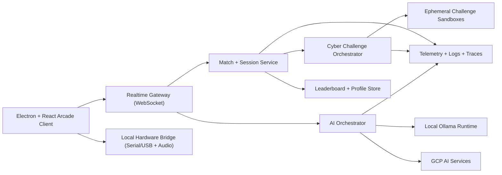

# AI-Powered Arcade Platform Architecture

## Vision

Build a multiplayer arcade ecosystem where each session blends:
- real-time game competition,
- AI-driven orchestration and hints (GCP + Ollama),
- physical hardware and audio feedback loops,
- sandboxed offensive/defensive cyber mini-challenges.

This document defines a target architecture that can be implemented incrementally on top of the existing Electron + React + DIY hardware base.

## Product Pillars

1. Multiplayer first
   - Real-time lobbies, matchmaking, session state sync, and tournaments.
2. AI at runtime
   - Low-latency local intelligence through Ollama, with cloud-assisted reasoning on GCP.
3. Physical interactivity
   - Hardware-triggered actions (buttons/NFC/IR/GPIO) and adaptive audio events.
4. Safe cyber gameplay
   - Isolated offensive/defensive challenges with strict containment and observability.

## High-Level System Design

## Core Services

### 1) Realtime Gateway
- Maintains low-latency multiplayer channels (game ticks, inputs, events).
- Supports authenticated WebSocket sessions with reconnect and state resync.
- Publishes events to downstream services via pub/sub bus.

### 2) Match and Session Service
- Owns lobby lifecycle, matchmaking, round timing, and scoring.
- Handles authoritative state transitions to prevent client-side cheating.
- Persists match summaries and ranking updates.

### 3) AI Orchestrator (GCP + Ollama)
- Routes inference requests by latency and cost policy:
  - local Ollama for instant tactical feedback,
  - GCP models for deeper post-round analysis or moderation.
- Produces structured outputs:
  - hints,
  - dynamic challenge adjustments,
  - anti-abuse and anomaly flags.

### 4) Hardware + Audio Interaction Layer
- Consumes local input events from the existing DIY Flipper serial channel.
- Maps events to game actions and cyber challenge interactions.
- Drives reactive audio cues (threat alert, successful exploit, defense recovered).
- Streams selected non-sensitive event metadata to session services.

### 5) Cyber Challenge Orchestrator
- Allocates per-session challenge environments for offense/defense drills.
- Tracks challenge objectives, scoring, and completion evidence.
- Supports challenge templates:
  - web app attack/patch loop,
  - network defense hardening,
  - forensic log triage,
  - reverse-engineering puzzles.

### 6) Sandboxed Execution Runtime
- Ephemeral, isolated compute for every challenge instance.
- Mandatory controls:
  - per-instance network policy (deny by default),
  - filesystem quotas and auto-teardown TTL,
  - no host privilege escalation,
  - immutable challenge images.

## Security Model

1. Identity and access
   - OAuth/OIDC user login, short-lived session tokens, and signed websocket auth.
2. Isolation boundaries
   - hard separation between player client, control plane, and challenge runtimes.
3. Data protection
   - encrypted transport, encrypted-at-rest storage, and minimum data retention.
4. Abuse controls
   - rate limits, anti-cheat heuristics, and model-assisted moderation.
5. Auditability
   - append-only challenge event logs and replayable match traces.

## GCP Reference Stack

- Compute/API:
  - Cloud Run services for gateway, match service, and AI orchestrator.
- Messaging:
  - Pub/Sub for gameplay and AI event fan-out.
- Data:
  - Cloud SQL or Firestore for profiles, sessions, and leaderboards.
  - Memorystore (Redis) for realtime state cache and lock coordination.
- Security:
  - Secret Manager, IAM least privilege, Cloud Armor, Identity-Aware controls.
- Observability:
  - Cloud Logging + Monitoring + Error Reporting + Trace.
- Sandbox runtime:
  - GKE Autopilot or managed container runtime with gVisor-like isolation profile.

## Ollama Runtime Pattern

1. Local edge node (near client/session region) hosts curated models for low-latency tasks.
2. AI Orchestrator applies policy:
   - if latency budget < 150ms -> local Ollama,
   - else -> cloud model route (for larger context tasks).
3. All model responses are validated against schema before client delivery.

## Event and Data Flows

### Multiplayer Loop
1. Client input -> Realtime Gateway.
2. Gateway forwards to Match Service.
3. Match Service emits authoritative state.
4. Gateway broadcasts updates to all players.

### AI-Augmented Gameplay Loop
1. Match event triggers AI request.
2. AI Orchestrator selects Ollama or GCP path.
3. Response is normalized and risk-checked.
4. Hint/modifier is injected into match timeline.

### Cyber Challenge Loop
1. Session enters challenge phase.
2. Cyber Orchestrator allocates sandbox instance.
3. Players perform offense/defense tasks in isolated environment.
4. Evidence/telemetry scored and merged into session leaderboard.
5. Sandbox is destroyed on completion/timeout.

## Implementation Phases

### Phase 0: Foundation (current -> next)
- Keep existing Electron launcher and hardware integration.
- Introduce backend service skeletons (gateway + session service + auth).
- Define event schemas (JSON schema/protobuf) for client, AI, and cyber modules.

### Phase 1: Multiplayer Baseline
- Add lobby creation/join, presence, and synchronized game state for selected titles.
- Persist player accounts and leaderboard v1.

### Phase 2: AI Runtime Integration
- Add AI Orchestrator service.
- Integrate local Ollama endpoint and policy routing.
- Surface real-time hints and adaptive difficulty.

### Phase 3: Cyber Sandbox v1
- Deploy orchestrated challenge containers with strict network and TTL controls.
- Release first offense/defense challenge pack with scoring API.

### Phase 4: Hardware + Audio Immersion
- Expand serial command mapping for physical actions.
- Add dynamic audio event engine tied to threat and score states.

### Phase 5: Competitive Operations
- Tournament mode, anti-cheat analytics, replay system, and admin dashboards.

## Success Metrics

- P95 multiplayer input-to-state latency < 120ms (regional).
- AI assist response P95 < 300ms for local-routing scenarios.
- 100% automatic teardown of sandbox instances after session end.
- Zero cross-session sandbox data leakage.
- Session retention and replay rate increasing per release.

## Immediate Engineering Backlog

1. Define canonical event contracts (`session.event.v1`, `ai.hint.v1`, `cyber.result.v1`).
2. Build WebSocket gateway prototype and reconnect logic.
3. Add auth token flow in Electron client.
4. Stand up Ollama integration adapter with structured output validation.
5. Create one fully isolated cyber challenge template with automated teardown tests.
